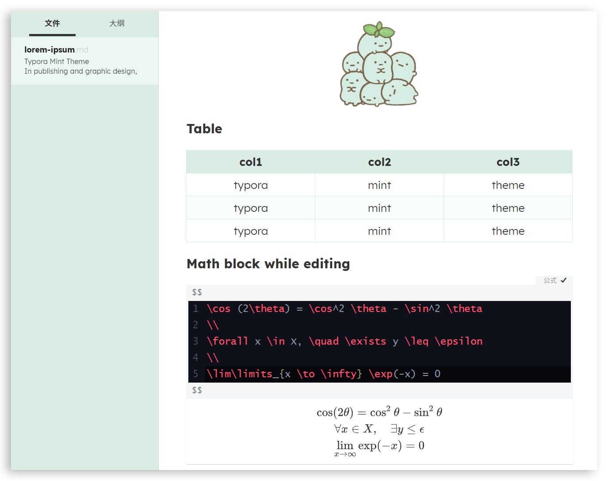

# typora-mint-theme

A fresh mint theme for typora. 

## Feature

- Supports **English** and **中文**.
- Supports **dark mode**
- Code color scheme imported from [material-ocean](https://codemirror.net/theme/material-ocean.css)
- Legible **math block** with dark background and light text

## Screenshot

## Install

1. Download `mint.css`,  `mint-dark.css`, and `mint` folder 

    (Note: if you want to use `mint-dark theme`, `mint.css` is required)

2. Open Theme Folder from `Preference Panel` → `Appearance` section.

3. Copy `mint.css`,  `mint-dark.css`, and `mint` folder into the newly opened folder.

4. Restart typora, then select `mint` or `mint-dark` from `Themes` menu.
